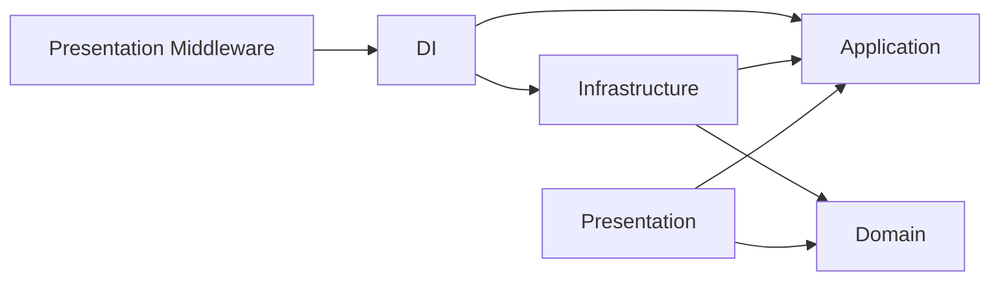
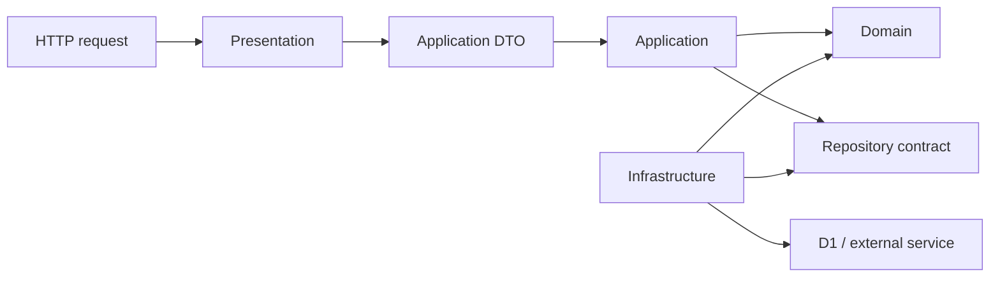

# ARCHITECTURE.md — rectime-api

## 概要

`rectime-api`はPresentation、Application、Domain、Infrastructureの4層で責務を分ける。

## 4層と依存方向

```text
Presentation → Application / Domain
Presentation Middleware → DI
Application → Domain
Infrastructure → Application / Domain
DI → Application / Infrastructure
```



- Domainは他の層に依存しない。
- PresentationはApplicationとDomainを利用できる。
- PresentationのDI Middlewareだけは、DIコンテナをContextへ注入するためDIを利用できる。
- Applicationはユースケースと、複数機能をまたぐ処理の調整を担当する。
- InfrastructureはApplicationとDomainの契約を実装する。
- DIで契約と実装を組み合わせる。
- ApplicationからInfrastructureの具体実装へは原則として直接依存しない。

## 配置

| Path                            | 配置するもの                         |
| ------------------------------- | ------------------------------------ |
| `src/index.ts`                  | Routeとentry point                   |
| `src/presentation/`             | HTTP入力、レスポンス、Middleware     |
| `src/application/services/`     | Application Service                  |
| `src/application/dto/`          | Applicationで利用する入出力型        |
| `src/domain/entities/`          | Domain Entity                        |
| `src/domain/interfaces/`        | RepositoryやQueueなどの契約          |
| `src/infrastructure/`           | Repository、DB、認証、Queue等の実装  |
| `src/di/`                       | 依存関係の組み立て                   |
| `src/lib/`                      | DBや環境変数の共通処理               |
| `src/types/`                    | Bindingなどの共通型                  |
| `migrations/`                   | D1 migration                         |
| `test/`                         | Testとfixture                        |

## 型の境界

- HTTPのrequest body、query、responseの契約は`src/application/dto/`に置く。
- Application ServiceはDTOとDomain型を変換する。
- Domain modelとRepositoryの入力、検索条件、戻り値は`src/domain/`に置く。
- RepositoryはDTOを受け取らない。



## 共通ルール

- 必要なdirectoryだけ作る。
- 1fileに1つの責務を持たせる。
- 循環依存を作らない。

## 各層のルール

### Presentation

- ControllerはHTTP入力の取得と検証、HTTPレスポンスへの変換を行う。
- MiddlewareはHTTPに共通する処理だけを持つ。
- 業務ルール、DB操作、外部サービスの処理は書かない。

### Application

- Application Serviceはユースケースを実行する。
- 複数の機能をまたぐ処理はApplication Serviceで調整する。
- 外部サービスや永続化は契約を介して利用する。

### Domain

- Entity、Repositoryなどの契約と入出力型を置く。
- 業務ルールはFrameworkに依存させない。
- HTTP、DB schema、外部サービスの形式を持ち込まない。

### Infrastructure

- RepositoryはD1の操作とDB rowからEntityへの変換を行う。
- 認証、Queue、ファイル解析、外部サービス連携などの具体実装を置く。
- Schema変更時は`migrations/`に新しいSQL fileを追加する。
- 適用済みのmigrationは変更しない。
- HTTPの入力処理と業務ルールは書かない。
